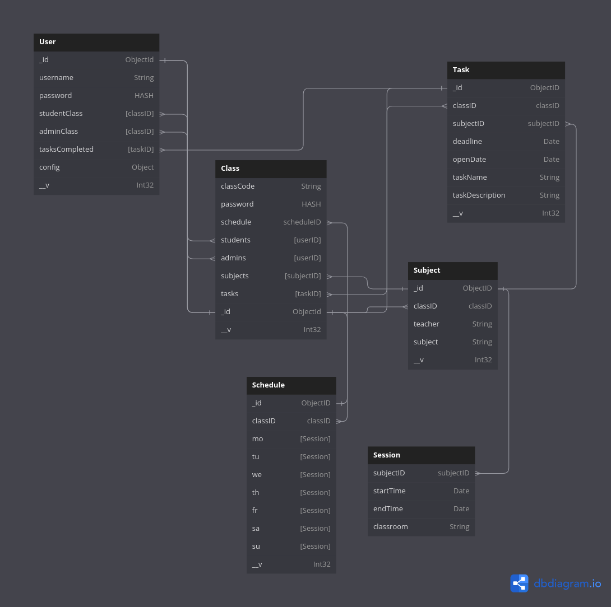

# API v1 - DB Schemas

The are all the DB Schemas of this API version. You can go back [here](../README.md).

### Table of content

- [Grapgic Diagram](#grapgic-diagram)
- [DB Schemas](#db-schema-user)
  - [User](#db-schema-user)
  - [Class](#db-schema-class)
  - [Subject](#db-schema-subject)
  - [Task](#db-schema-task)
  - [Schedule](#db-schema-schedule)


## Graphic Diagram

You can see a graphic representation [here](https://dbdiagram.io/d/658dcf2789dea62799b2415b) or in the image below.




## DB Schema: `User`

### Important

- The fields `_id` and `__v` are assigned by MongoDB, the client can't change it.
- the `config` field is reserved for the client. Use an unique id for each front-end. `{ "official-web": {...} }`

### Struct

```javascript
{
 "_id": ObjectID, // Assigned by MongoDB
 "username": String,
 "password": HASH,
 "studentClass": [classID, classID],
 "adminClass": [classID, classID],
 "tasksCompleted": [taskID, taskID],
 "config": { <client>: {}, <client>: {} }, // Any JSON, the server wont validate a format, you can put anything you need.
 "__v": Int32 // Assigned by Mongoose
}
```


## DB Schema: `Class`

### Struct

```javascript
{
 "_id": ObjectID, // Assigned by MongoDB
 "classCode": String,
 "password": HASH,
 "students": [userID, userID],
 "admins": [userID, userID],
 "tasks": [taskID, taskID],
 "subjects": [subjectID, subjectID],
 "shcedule": scheduleID, 
 "__v": Int32 // Assigned by Mongoose
}
```


## DB Schema: `Subject`

### Struct

```javascript
{
 "_id": ObjectID, // Assigned by MongoDB
 "classID": classID,
 "teacher": String,
 "subject": String,
 "__v": Int32 // Assigned by Mongoose
}
```


## DB Schema: `Task`

### Struct

```javascript
{
 "_id": ObjectID, // Assigned by MongoDB
 "classID": classID,
 "subjectID": subjectID,
 "deadline": Date,
 "openDate": Date,
 "taskName": String,
 "taskDescription": String,
 "__v": Int32 // Assigned by Mongoose
}
```


## DB Schema: `Schedule`

### Important

- The `startTime` and `endTime` fields only needs the time value, the day part of the date can be anything.
- The flields `mo`, `tu`, `we`, `th`, `fr`, `sa` and `su` represent the week days.
  - `mo = Monday`
  - `tu = Tuesday`
  - `we = Wednesday`
  - `th = Thursday`
  - `fr = Friday`
  - `sa = Saturday`
  - `su = Sunday`

### Struct

```javascript
{
 "_id": ObjectID, // Assigned by MongoDB
 "classID": classID,
 "mo": [{
    "subjectID": subjectID,
    "startTime": Date,
    "endTime": Date,
    "classroom": String
  }],
 "tu": [{}], // Here and then repeats the same schema that "mo"
 "we": [{}],
 "th": [{}],
 "fr": [{}],
 "sa": [{}],
 "su": [{}]
 "__v": Int32 // Assigned by Mongoose
}
```